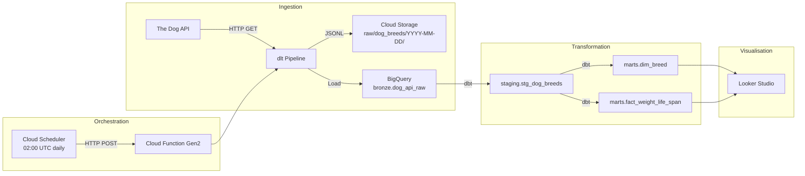

# Dog Breed Explorer

[](https://github.com/mhaegeman/dog-breed/actions/workflows/ci.yml)
[](https://github.com/mhaegeman/dog-breed/actions/workflows/deploy.yml)

An end-to-end data pipeline on **Google Cloud Platform** that ingests dog breed data from [The Dog API](https://thedogapi.com), models it with **dbt** in BigQuery, and serves curated analytics for a "Dog Breed Explorer" product.

---

## Architecture



## Repository Structure

```
├── ingestion/           # dlt pipeline, Cloud Function entry-point, deploy script
├── dbt/                 # dbt Core project (staging → marts)
├── .github/workflows/   # CI (PR) and deploy (merge to main)
├── docs/queries/        # SQL queries for Looker Studio dashboards
└── README.md
```

---

## Prerequisites

| Tool | Version |
|------|---------|
| Python | 3.12+ |
| gcloud CLI | latest |
| dbt-bigquery | latest |
| GCP project | billing enabled, BigQuery + Cloud Storage + Cloud Functions + Cloud Scheduler APIs active |

**Service account** needs these roles: `BigQuery Data Editor`, `BigQuery Job User`, `Storage Object Admin`, `Cloud Functions Developer`.

---

## Bootstrap

```bash
# 1. Clone the repository
git clone https://github.com/mhaegeman/dog-breed.git
cd dog-breed

# 2. Create a virtual environment
python -m venv venv && source venv/bin/activate

# 3. Ensure setuptools is available (required by dlt on Python 3.12+)
pip install --upgrade pip setuptools

# 4. Install all Python dependencies (single call avoids version conflicts)
pip install -r ingestion/requirements.txt

# 5. Install dbt packages
cd dbt && dbt deps && cd ..

# 6. Set required environment variables
export GCP_PROJECT_ID="your-project-id"
export DOG_API_KEY="your-api-key"
export DESTINATION__FILESYSTEM__BUCKET_URL="gs://your-bucket"

# 7. Authenticate to Google Cloud
gcloud auth login
gcloud auth application-default login
gcloud config set project $GCP_PROJECT_ID

# 8. Run the ingestion pipeline locally
cd ingestion && python pipeline.py && cd ..

# 9. Run dbt
cd dbt && dbt build --target dev && cd ..
```

### GitHub Secrets (for CI/CD)

| Secret | Description |
|--------|-------------|
| `GCP_PROJECT_ID` | Your GCP project ID |
| `GCP_REGION` | Deployment region (e.g. `us-central1`) |
| `GCP_SA_KEY` | Service account JSON key (base64 or raw) |
| `DOG_API_KEY` | The Dog API key |
| `GCS_BUCKET_URL` | `gs://your-bucket-name` |
| `SA_EMAIL` | Service account email |

---

## Data Model

| Layer | Table | Description |
|-------|-------|-------------|
| Bronze | `bronze.dog_api_raw` | Raw data from The Dog API (loaded by dlt) |
| Staging | `staging.stg_dog_breeds` | Cleaned, type-cast, parsed numeric fields |
| Mart | `marts.dim_breed` | Breed dimension with weight class & family-friendly flag |
| Mart | `marts.fact_weight_life_span` | Numeric measurements: weight, height, life span |

### Tests

- **Schema tests**: `unique`, `not_null` on primary keys; `accepted_values` on weight_class
- **Referential integrity**: `relationships` between fact and dim
- **Custom generic**: `positive_values` — asserts numeric columns > 0
- **Singular test**: `assert_life_span_range_valid` — min never exceeds max

---

## Looker Studio Queries

Pre-built SQL queries are in [`docs/queries/`](docs/queries/):

1. **Longest life span** — Top 20 breeds by predicted life span
2. **Weight class distribution** — Breed counts and averages per size bucket
3. **Family-friendly temperaments** — Most common traits among gentle breeds

---

## Business Insights

Analysis of ~170 breeds from The Dog API reveals several actionable patterns for the Dog Breed Explorer product.

**Smaller breeds live longer.** There is a clear inverse correlation between body weight and life expectancy. Toy and Small breeds average 12-16 years, while Giant breeds average 7-10 years. This is the single most impactful insight for prospective dog owners weighing breed choices — and it mirrors established veterinary research on canine longevity.

**The "medium" sweet spot.** Medium-weight breeds (25-50 lbs) represent the largest share of recognized breeds and offer a balanced trade-off: moderate life spans (10-13 years), manageable size for urban living, and broad temperament variety. Product recommendations could default to this class for first-time owners.

**Family-friendly breeds cluster around specific traits.** Breeds flagged as family-friendly disproportionately share six temperament keywords: *Loyal*, *Friendly*, *Playful*, *Gentle*, *Affectionate*, and *Good-natured*. Notably, these breeds span every weight class — families are not limited to a single size. Surfacing this in the Explorer lets users filter by lifestyle rather than just physical attributes.

**Breed group gaps.** Some AKC groups (Herding, Sporting) are well-represented, while others (Foundation Stock) have sparse data. Flagging coverage gaps helps the product team prioritise data enrichment from secondary sources.

These insights power the three recommended Looker Studio dashboard views and provide a foundation for a recommendation engine in future iterations.

---

## Manual GCP Steps

After deploying, verify the following in the GCP Console:

1. **BigQuery** — Confirm `bronze.dog_api_raw` table exists with ~170 rows
2. **Cloud Storage** — Check `raw/dog_breeds/YYYY-MM-DD/` partition in your bucket
3. **Cloud Functions** — Verify `dog-breed-ingest` function is active and healthy
4. **Cloud Scheduler** — Confirm `dog-breed-daily` job is scheduled at `0 2 * * *`
5. **GitHub Actions** — Open a PR to validate the CI workflow passes
